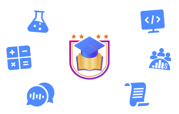

# 🧠✨ Cleverly - Learning Buddy  
**A seamless fusion of intelligence, design, and interactivity**

> Personalized, real-time, voice-driven education.
> Built for students, creators, and curious minds who believe learning should feel like a conversation.

---

## 🚀 Overview
An innovative **AI learning platform** that blends **real-time voice interaction**, **personalized tutoring**, and **instant knowledge retrieval** - designed to make education feel more human, engaging, and dynamic.

The app adapts to each learner’s pace, responding naturally through voice and text, while maintaining scalability and performance across devices.

---

## 🧩 Core Features
- 🗣️ **Voice-Driven Learning** — natural speech interaction via AI  
- ⚡ **Real-Time AI Responses** — powered by dynamic Supabase operations  
- 🔐 **Secure Auth & Sessions** — managed with Clerk authentication  
- 📊 **Scalable Architecture** — built on React, Next.js, and TypeScript  
- 🧠 **Adaptive Intelligence** — context-aware recommendations and feedback  
- 🎨 **Modern UI/UX** — designed with Tailwind CSS for responsiveness  

---

## 🖼️ Preview
  
*Smarter. Faster. More connected.*

---

## 🛠️ Tech Stack
| Category | Tools |
|-----------|-------|
| **Language** | TS |
| **Frameworks & Libraries** | Next.js, React |
| **Database** | Supabase |
| **Authentication** | Clerk |
| **Styling** | Tailwind CSS |
| **Deployment** | Vercel |

---